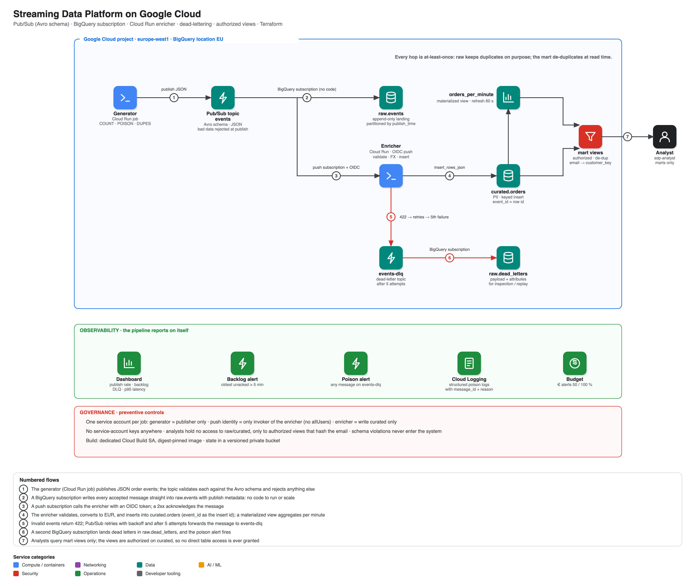

# Architecture

## Data zones

| Zone | Contents | Who can read it |
|---|---|---|
| `raw` | `events` (every accepted message, incl. duplicates), `dead_letters` | pipeline only |
| `curated` | `orders` (validated + EUR-converted, has PII), `orders_per_minute_mv` | enricher writes; nobody else directly |
| `mart` | `orders_masked`, `orders_per_minute` (authorized views) | analysts |

## Delivery semantics
Pub/Sub → BigQuery subscription and push delivery are **at-least-once**. Nothing is silently dropped; duplicates are kept in `raw` on purpose and removed at read time in `mart.orders_masked` (`ROW_NUMBER() OVER (PARTITION BY event_id …)`). The enricher uses `event_id` as the streaming-insert id (best-effort dedupe) but correctness does not depend on it.

## Identities
| Service account | Can do | Cannot do |
|---|---|---|
| `sdp-generator` | publish to `events` | read anything |
| `sdp-push` | invoke the enricher (Pub/Sub presents its OIDC token) | anything else |
| `sdp-enricher` | write `curated`, run BigQuery jobs | read `raw`, publish |
| `sdp-analyst` | read `mart`, run jobs | read `raw` / `curated` |
| `sdp-build` | push images, write build logs | deploy |
| Pub/Sub service agent | write `raw`, publish to the DLQ, ack, mint the push token | — |

## Measured behaviour (this build)
Event → enriched row: **p50 2.2 s / p95 5.6 s** with a warm enricher; **17.6 s / 18.6 s** when the run started from zero instances (cold start + burst). Cloud Run scales 0→5; `min_instance_count = 0` keeps the idle cost at zero.
